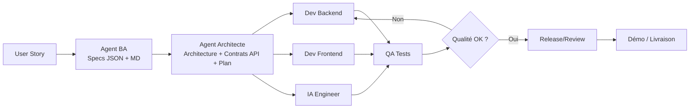

# Agent System Pack — ClaimFlow AI

> **But** : Un pack unique et opérationnel pour piloter **toute la chaîne** d’industrialisation avec Claude Code : User Story → Specs → Architecture → Implémentation (Front/Back/IA) → Tests → Release, en workflows complets **ou** partiels. 

---

## 0) Contexte & périmètre
- Produit cible : **ClaimFlow AI**, portail de gestion de sinistres automobiles augmenté par IA (extraction, fraude, estimation, courriers). citeturn1search1
- Stack de référence : **Next.js 15, TypeScript strict, Prisma, SQLite→PostgreSQL, NextAuth v5, Anthropic/Claude**. citeturn1search1
- Épics prioritaires : **Auth, Déclaration, IA, Workflow**, puis Dashboard, Administration. citeturn1search1
- Règles critiques : **auto‑approbation (< 2000 € & fraude < 30)**, **escalade (fraude > 70)**, **numérotation SIN‑YYYY‑NNNNN**, **alerte 48h**. citeturn1search1

---

## 1) Roster des Agents (multi‑disciplinaires)

Chaque agent définit : **Mission**, **Entrées**, **Sorties**, **Responsabilités**, **Skills**, **Commande Claude Code**, **Handover** (vers qui il passe la main).

### 1.1 Agent **BA — Business Analyst**
- **Mission** : transformer toute *User Story* en **spécifications fonctionnelles actionnables**.
- **Entrées** : User Story en NL, contraintes métier, maquettes éventuelles.
- **Sorties** : Règles métier, Critères d’acceptation (Gherkin), Cas limites, Flux métier textuel, Impacts sur modèle de données, JSON structuré + version Markdown.
- **Responsabilités** : clarification, découpage, priorisation, *Definition of Ready* (DoR).
- **Skills** : Requirement expansion, Business rule mapping, Edge case detection, Domain modelling, Acceptance criteria.
- **Commande** :
```text
/ba
Voici la user story : "En tant que ...".
Transforme-la en specs complètes : règles métier, critères Gherkin, cas limites, flux, impacts données. Formate en JSON + Markdown.
```
- **Handover** : → **Architecte**.

### 1.2 Agent **Architecte — Orchestration Technique**
- **Mission** : convertir les specs BA en **architecture** + **plan d’implémentation** (modules, contrats API, schéma DB, dépendances, charges).
- **Entrées** : Specs BA (JSON/MD), backlog, contraintes stack.
- **Sorties** : Schéma global, modules, **contrats API** (routes, I/O, erreurs), **mises à jour Prisma**, **tasks par équipe** (Front/Back/IA/QA), graphe de dépendances, *Definition of Done* (DoD).
- **Skills** : System design, API modelling, Prisma schema design, Dependency graph building, Technical planning.
- **Commande** :
```text
/architect
Voici les specs du BA :
<coller ici>
Produis architecture, contrats API, plan d’implémentation, dépendances, DoD.
```
- **Handover** : → **Dev Backend**, **Dev Frontend**, **IA**, **QA**.

### 1.3 Agent **Dev Backend**
- **Mission** : implémenter l’API REST, services métier/IA, migrations Prisma, validations Zod, permissions & logs.
- **Entrées** : Plan Architecte, contrats API, schéma Prisma, règles métier.
- **Sorties** : Routes Next.js API, services (extraction/fraude/estimation/courrier), migrations, tests d’intégration, audit trail. citeturn1search1turn1search2
- **Skills** : Code generation, Prisma modelling, Zod validation, Error handling, Integration testing, Security hardening.
- **Commande** :
```text
/backend
Plan technique fourni.
Génère Prisma (models + migrations), endpoints API, services métier/IA, validations Zod, tests d’intégration.
```
- **Handover** : → **QA** + **Frontend** (consommation API).

### 1.4 Agent **Dev Frontend**
- **Mission** : construire UI Next.js (pages, composants, formulaires), intégrer API, charts, gestion d’état, accessibilité.
- **Entrées** : Plan Architecte, contrats API, listes d’écrans & critères d’acceptation.
- **Sorties** : Pages **/claims, /claims/new, /claims/[id], /dashboard, /admin**; composants **ClaimForm (4 étapes), AIAnalysisPanel, FraudScoreCard, EstimationCard, LetterGenerator, Timeline, Dashboard charts**. citeturn1search2
- **Skills** : UI code generation, React composition, Form builder (RHF+Zod), UX/State, Component testing.
- **Commande** :
```text
/frontend
Plan fourni.
Génère pages, composants (ClaimForm 4 étapes, AI panels, Dashboard), intégration API, validations.
```
- **Handover** : → **QA**.

### 1.5 Agent **IA Engineer**
- **Mission** : prompts système, **Agent Teams** (extraction, fraude, estimation, courrier), endpoints IA, **orchestration** (analyze claim), hooks qualité.
- **Entrées** : Règles métier, barèmes MCP, contrats API.
- **Sorties** : 4 prompts, endpoints **/api/ai/**, orchestration **POST /api/claims/:id/analyze**, stockage dans **AIAnalysis**. citeturn1search1turn1search2
- **Skills** : Prompt engineering, Agent Teams, JSON schema enforcing, Orchestration, Hooks.
- **Commande** :
```text
/ia
Créer prompts, Agent Team (extractor, fraud, estimator, letter), endpoints IA et orchestration /claims/:id/analyze. Valide sortie JSON.
```
- **Handover** : → **Frontend** (UI IA) + **Backend** (persistence).

### 1.6 Agent **QA — Tests & Qualité**
- **Mission** : TDD backend (Vitest), Tests composants, **E2E Playwright** (login, création sinistre, dashboard), couverture > 60 %, détection régressions. citeturn1search2
- **Entrées** : Code front/back/IA, critères d’acceptation.
- **Sorties** : Suites de tests, rapports, bugs, validation de la démo finale. citeturn1search2
- **Skills** : TDD, Scenario building, E2E planning, Bug reproduction, Coverage optimisation.
- **Commande** :
```text
/qa
Génère TDD backend, tests composants React, E2E Playwright. Rapporte anomalies + propose correctifs.
```
- **Handover** : ↔ **Front/Back** (boucles de fix).

### 1.7 Agent **MCP — Barèmes & Données Externes**
- **Mission** : exposer barèmes d’indemnisation via serveur **MCP**; option météo au moment du sinistre. citeturn1search2
- **Entrées** : Tables barémiques, sources externes autorisées.
- **Sorties** : Réponses **JSON** normalisées pour l’IA/Frontend.
- **Skills** : MCP Servers, Data normalization, API wrapping, Caching.
- **Commande** :
```text
/mcp
Créer un MCP local exposant les barèmes d’indemnisation par type de sinistre. Répond en JSON stable.
```
- **Handover** : → **IA Engineer** + **Frontend** (affichage barème).

### 1.8 Agent **Release/Review — Sécurité & Livraison**
- **Mission** : revue de code, conventions, messages `/commit`, audit sécurité, optimisation perf, packaging démo.
- **Entrées** : PRs, rapports QA.
- **Sorties** : Commentaires review, corrections, notes de version, artefacts déployables.
- **Skills** : Code review, Multi‑file edit, Security hardening, /commit, CI basics.
- **Commande** :
```text
/review
Passe en revue le code (sécurité, performance, lisibilité), propose correctifs. Prépare un /commit conventionnel.
```

---

## 2) Catalogue des Skills

### 2.1 **Skills Claude Code (14 officielles)**
- Scaffolding • Plan mode • Code generation • TDD • Debugging • Agent Teams • MCP Servers • Hooks • Multi‑file edit • Refactoring • Code review • /commit • Tests E2E • Tests composants. citeturn1search2

### 2.2 **Compétences d’ingénierie additionnelles**
- Prompt engineering • JSON structure validation • System design • API modelling • Prisma schema design • Domain & data flow modelling • Dependency graph building • Workflow orchestration • UX rule enforcement • Regression detection.

### 2.3 **Matrice Agent → Skills (extrait)**
- **BA** : Requirement expansion, Acceptance criteria, Domain modelling.
- **Architecte** : System design, API modelling, Dependency graphs, Technical planning.
- **Dev Backend** : Code generation, Prisma modelling, Zod, Integration tests, Security.
- **Dev Frontend** : UI generation, Forms, State, Component tests.
- **IA Engineer** : Prompt engineering, Agent Teams, Orchestration, Hooks.
- **QA** : TDD, E2E, Component tests, Coverage.
- **MCP** : MCP Servers, Data normalization.
- **Release/Review** : Code review, Multi‑file edit, /commit.

---

## 3) Workflows (complets & partiels)

### 3.1 **Workflow Complet**


### 3.2 **Workflows partiels (raccourcis)**
- **/ba** seul : User Story → Specs.
- **/architect** seul : Specs → Architecture & Plan.
- **/backend | /frontend | /ia** : Implémentation ciblée.
- **/qa** : Validation isolée (régression ou sprint hardening).

### 3.3 **États & règles clés intégrées au workflow**
- Cycle de vie dossier : `SUBMITTED → UNDER_REVIEW → INFO_REQUESTED → APPROVED/REJECTED → CLOSED`. citeturn1search1
- Auto‑approbation : **montant < 2 000 € & fraude < 30**. Escalade : **fraude > 70**. citeturn1search1
- Numérotation : `SIN-YYYY-NNNNN`. Alerte : **aucune action 48h**. citeturn1search1

---

## 4) Gabarits d’invites (prompts) prêts à l’emploi

### 4.1 **BA — User Story → Specs**
```text
/ba
Contexte produit: ClaimFlow AI (gestion de sinistres auto + IA).
User Story: "En tant que <persona>, je veux <objectif> afin de <valeur>."
Livrables: 1) Règles métier 2) Critères Gherkin 3) Cas limites 4) Flux textuel 5) Impacts données 6) JSON structuré 7) Markdown lisible.
Contraintes: respecter termes métier & champs clés (assuré, véhicule, circonstances, documents).
```

### 4.2 **Architecte — Specs → Plan technique**
```text
/architect
Entrée: <JSON specs BA>.
Attendus: Architecture Next.js 15 + Prisma + NextAuth + Claude; contrats API (routes/méthodes, schémas I/O Zod, erreurs);
Mises à jour Prisma; tâches par équipe; dépendances; DoD.
```

### 4.3 **Backend — Plan → Code**
```text
/backend
Entrée: <Plan Architecte>.
Génère: prisma/schema.prisma (+ migrations), services business, routes /api/claims|policyholders|comments|documents|dashboard|admin,
PATCH /api/claims/:id/status & /assign, POST /api/claims/:id/analyze, validations Zod, audit trail, tests d’intégration.
Contraintes upload : valider côté serveur max 10 Mo/fichier, formats autorisés PDF/JPG/PNG uniquement (rejection 400 sinon).
```

### 4.4 **Frontend — Plan → UI**
```text
/frontend
Entrée: <Plan Architecte>.
Génère: pages /dashboard, /claims, /claims/new, /claims/[id], /admin; composants ClaimForm(4 étapes), AIAnalysisPanel,
FraudScoreCard (jauge, couleurs), EstimationCard, LetterGenerator, ClaimTimeline, Recharts charts; état de chargement & erreurs.
Upload (étape 4 du ClaimForm) : multi-fichiers, preview, validation client max 10 Mo/fichier, formats PDF/JPG/PNG, message d'erreur explicite si rejeté.
```

### 4.5 **IA — Prompts + Orchestration**
```text
/ia
Créer 4 prompts système (extraction, fraude, estimation, courrier), Agent Team parallèle, endpoints /api/ai/*, orchestration /api/claims/:id/analyze
(stockage dans AIAnalysis), hooks de vérification structure JSON.
```

### 4.6 **QA — Tests**
```text
/qa
Produis: (1) TDD pour GET /api/claims (pagination, filtrage, recherche) (2) E2E Playwright: login, création sinistre, dashboard
(3) Tests composants: ClaimForm navigation/validation, FraudScoreCard couleurs, StatsCard valeurs. Couverture > 60%.
```

### 4.7 **MCP — Barèmes**
```text
/mcp
Implémente un serveur MCP local qui expose les barèmes d’indemnisation par type de sinistre (entrée: type, dégâts, contexte)
→ sortie JSON normalisée. Ajoute une commande pour interroger le MCP depuis l’IA.
```

### 4.8 **Release/Review — Qualité & Commit**
```text
/review
Passe en revue l’ensemble du code, signale failles / smells, propose patchs.
/commit
Génère un message conventionnel (feat, fix, chore) avec portée, sujet, body, BREAKING CHANGE si besoin.
```

---

## 5) Spécifications techniques ClaimFlow (rappel synthétique)
- **Modèles Prisma** : `User, Policyholder, Claim, Document, AIAnalysis, Comment, AuditLog`. citeturn1search1
- **Endpoints clés** : CRUD Claims, Policyholders, Comments, Documents; **/api/claims/:id/analyze**; Dashboard stats/charts; Admin (users, export). citeturn1search1turn1search2
- **Composants IA Front** : AIAnalysisPanel, FraudScoreCard, EstimationCard, LetterGenerator; **MCP barèmes** affiché à côté de l’estimation. citeturn1search2
- **Livrables sprint J1→J5** : init projet, API REST + tests, 4 endpoints IA + orchestration, dashboard + admin, tests > 60% + démo 15 min. citeturn1search2

---

## 6) Qualité, Gouvernance & Garde‑fous
- **DoR (Definition of Ready)** : Specs BA validées, critères Gherkin clairs, dépendances identifiées, jeux de données prêts.
- **DoD (Definition of Done)** : Tests verts (unit/E2E), couverture ≥ 60 %, critères d’acceptation vérifiés en démo, audit logs complets, sécurité basique checkée. citeturn1search2
- **Sécurité & conformité** : contrôle des rôles (Gestionnaire/Manager/Admin), validation entrée Zod, gestion documents (tailles/formats), journalisation. citeturn1search1
- **Observabilité** : KPIs dashboard (nb par statut, montant total, délai moyen, taux fraude) + timelines. citeturn1search2

---

## 7) « One‑Command Pipeline » (exemple orchestrateur)

```text
/run-pipeline
INPUT: User Story en clair.
Étapes:
  1) /ba → Génère specs (JSON + MD)
  2) /architect → Plan technique + contrats API + dépendances
  3) /backend + /frontend + /ia → Code + prompts + endpoints + UI
  4) /qa → TDD + E2E + tests composants + rapport
  5) /review + /commit → revue & message de commit
OUTPUT: MR prête à relire + consignes de démo (15 min).
```

---

## 8) Annexes

### 8.1 Variables d’environnement minimales
- `DATABASE_URL`, `NEXTAUTH_SECRET`, `NEXTAUTH_URL`, `ANTHROPIC_API_KEY`. citeturn1search1

### 8.2 Jeux & cas de test
- Utiliser le **jeu enrichi** (assurés, sinistres, fraude documentée) pour couvrir scénarios d’analyse. citeturn1search1

### 8.3 Rappels de priorisation
- MVP strict : livrer **Auth, Déclaration, IA, Workflow** avant Dashboard/Admin. citeturn1search1

---

**Fin — Agent System Pack**
